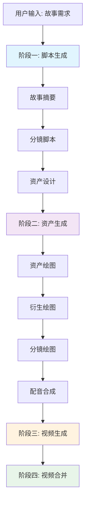
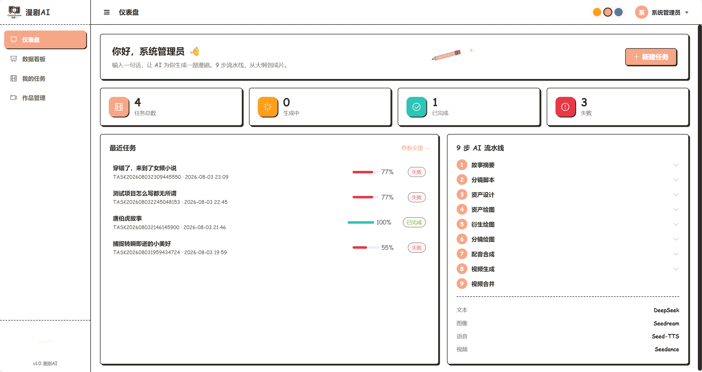
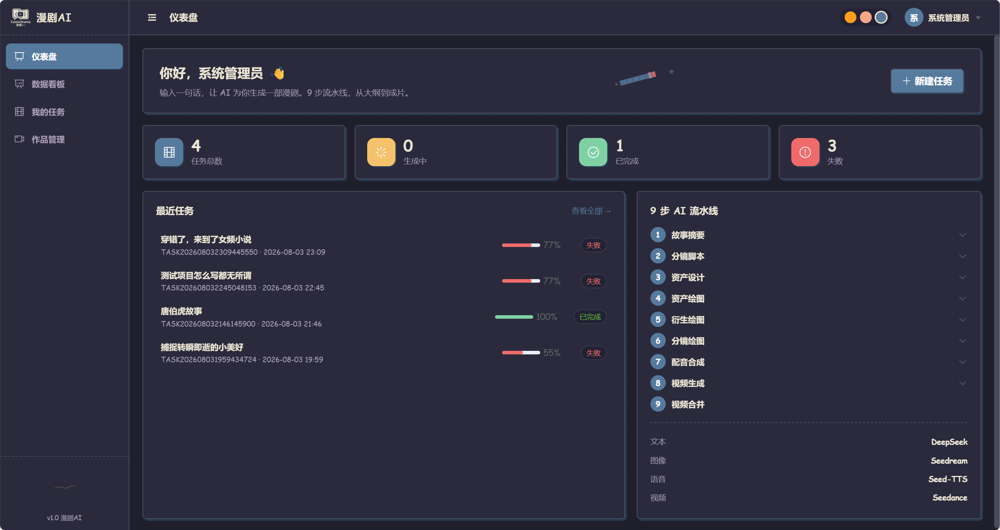
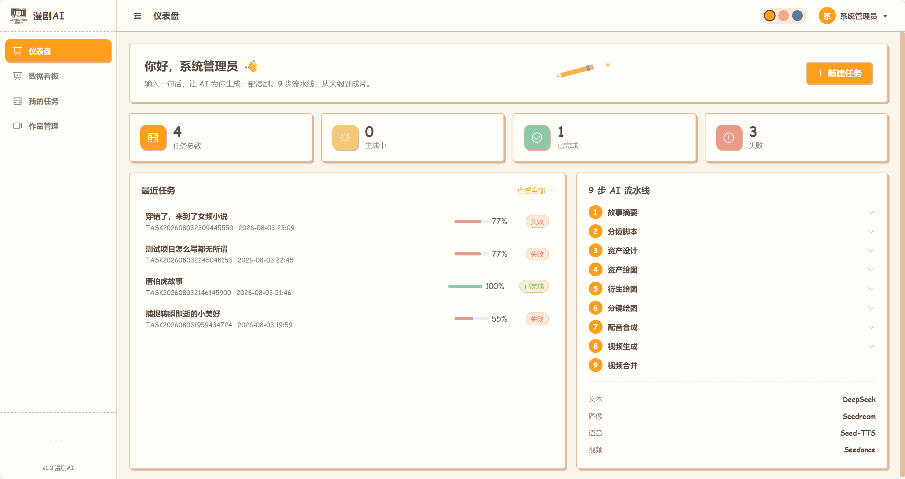
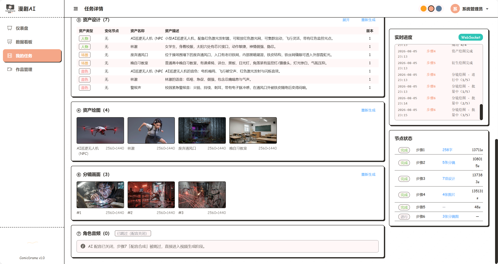
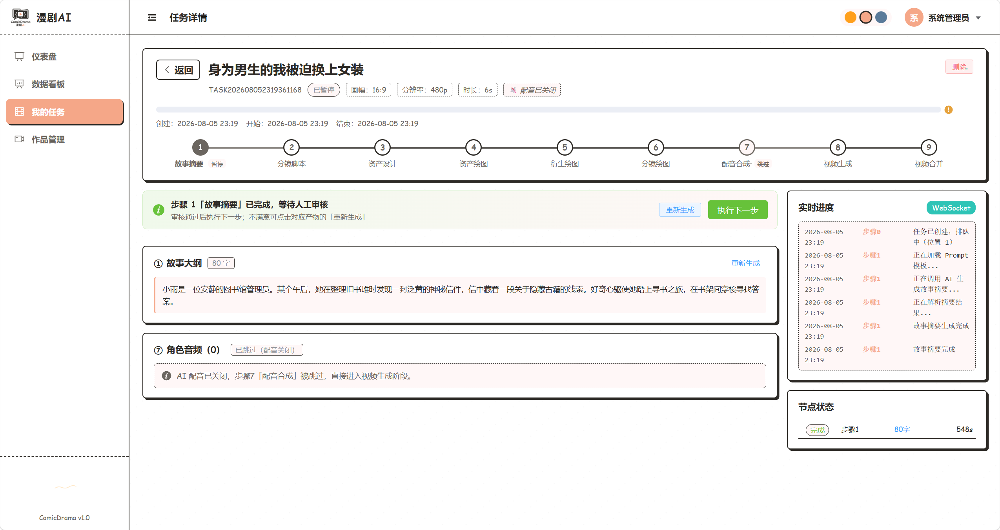

<div align="center">
  <p align="center"></p>
  <h1>ComicDrama 漫剧AI</h1>
  <p><b>标准化多媒体 AI 生产引擎，一站式完成文本 / 绘图 / 配音 / 分镜 / 成片全链路可管控流水线</b></p>
  <p>
    
    
    
    
    
    
  </p>
  <p>
    <a href="./README.md">中文</a> · 
    <a href="./docs/architecture.md">架构</a> · 
    <a href="./docs/deploy/install.md">部署</a> · 
    <a href="./docs/extension/plugin-dev.md">扩展</a>
  </p>
</div>

> 已落地漫剧商业生成场景，支持节点级断点恢复、逐阶段人工审核、分环节 Token 用量审计与成本核算，稳定承载批量成片任务。

---

## 一、项目简介

漫剧AI引擎 ComicDrama 是一个**分布式 AI 漫剧生产平台**，能够：
- 根据故事需求自动生成分镜脚本、角色/场景资产、配音音频
- 通过 AI 图像生成和 AI 视频生成，输出完整的漫剧作品
- 支持人工审核节点控制，灵活干预生成流程
- 支持单图/单资产独立重生成，版本追溯
- 支持三种主题（柔光/亮光/暗光）

**核心特点：**
- **微服务架构**：4 个独立服务 + 统一网关，各自端口独立（Eureka 已移除，服务直连）
- **协议化模型接入**：90% 新模型只需数据库配置，无需写 Java 代码
- **三阶段流水线**：脚本生成 → 视觉资产 → 视频合成，每阶段独立上下文
- **断点续跑**：任务失败后可从第一个未完成的步骤恢复
- **人工审核**：全自动模式/人工审核模式两种执行方式

### 行业痛点（为什么不用单 Agent 长链）

原生 LLM 长链 Agent 做多媒体生成存在三大顽疾：

- **上下文无限膨胀**：9 步链路全部塞进单一 Agent 上下文，Token 成本指数级飙升
- **一损俱损**：单步失败需从零重跑，前置成果作废，长任务交付不可控
- **黑盒执行**：无法人工介入审核、无法分环节核算成本、无法独立管控各模型权限

通用工作流框架（如 ComfyUI、LangFlow）偏重单一模态，缺乏文本/图像/语音/视频一体化编排、成片合并、资源持久化、计费审计的端到端能力。

### 量化收益（商用批量漫剧生产场景）

- 节点上下文隔离机制减少约 **65%~82%** Token 消耗
- 单任务失败恢复无需重跑前置步骤，平均交付时长缩短 **40%**
- 人工审核模式大幅降低成片返工率
- 资源资产沉淀复用机制，降低重复生成成本

---

## 二、核心能力

- **9 步多媒体工作流**：文本 → 视觉资产 → 音视频渲染，三段独立上下文
- **双模式调度**：全自动批量生产 + 人工审核精品制作（支持"完成此阶段"+"执行下一步"细粒度控制）
- **节点级断点恢复**：支持从「进行中」或「失败」步骤续跑，单图/单资产可独立重生成并修改参数
- **协议化 AI 接入**：按协议类型（openai-compatible / 自定义 HTTP）动态路由 Invoker，90% 新模型仅需配置
- **分环节 Token 计费**：每次 AI 调用独立记账，支持模型定价配置与成本聚合
- **实时进度推送**：WebSocket 双通道 + HTTP 轮询降级
- **多模型负载均衡**：权重随机 / 轮询 / 最少使用 / 一致性哈希 4 种策略
- **版本化资产生成**：资产/分镜/视频均带版本标识与衍生关系，支持回溯与对比
- **插件化扩展**：自定义步骤 / AI Invoker / 存储后端 / 任务队列

### AI 模型接入生态

引擎通过**协议化 Invoker 抽象**接入 AI 模型，按 `protocol:modelType` 路由，90% 新模型仅需在 `ai_model_config` 表配置即可，无需编码。

#### 已实现模型供应商

| 供应商 | 协议 | 支持类型 | 计费模式 | 典型模型 | 备注 |
|--------|------|---------|---------|---------|------|
| **ModelScope 魔搭** | `modelscope-chat` / `modelscope-image` | 文本、图像 | **免费**（平台赠送算力） | DeepSeek-V4-Pro、FLUX.2-KLEIN、Z-Image-Turbo | 默认启用，开箱即用 |
| **Agnes** | `agnes-video` | 视频 | **免费**（开发者额度） | agnes-video-v2.0 | 多关键帧视频生成，默认启用 |
| **DeepSeek** | `openai-chat` | 文本 | 免费额度 + 付费 | deepseek-v4-flash / v4-pro | 需自行配置 API Key |
| **火山引擎 / 豆包** | `ark-image` / `ark-tts` / `ark-video` | 图像、语音、视频 | 付费 | Seedream 5.0、Seed-TTS、Seedance 2.0 | 字节跳动 Ark 平台，需开通付费 |
| **OpenAI 兼容** | `openai-chat` | 文本 | 取决于服务商 | 任意兼容 `/chat/completions` 的服务 | 如 OpenAI、阿里百炼、腾讯混元等 |
| **自定义 HTTP** | `custom-http-{name}` | 文本/图像/语音/视频 | 取决于服务商 | 任意 HTTP API | YAML 模板驱动，JSONPath 响应解析 |
| **Mock 本地模拟** | `openai-chat` | 文本 | 免费（本地） | mock-test-text | 开发联调，无需任何 API Key |

#### 协议-模型类型映射

| 协议标识 | 中文名 | 支持模型类型 | 说明 |
|---------|--------|------------|------|
| `openai-chat` | OpenAI 兼容对话 | 文本 (1) | `/chat/completions` 兼容格式，覆盖 DeepSeek / 百炼 / 混元 等 |
| `modelscope-chat` | 魔搭对话 | 文本 (1) | 魔搭平台对话模型，通过 fallback 路由匹配到 DeepSeekInvoker |
| `modelscope-image` | 魔搭图像 | 图像 (2) | 魔搭平台图像生成，异步提交+轮询 |
| `ark-image` | 火山图像 | 图像 (2) | 豆包 Seedream 同步图像生成 |
| `ark-tts` | 火山语音 | 语音 (3) | 豆包 Seed-TTS 语音合成 |
| `ark-video` | 火山视频 | 视频 (4) | 豆包 Seedance 视频生成，异步+轮询 |
| `agnes-video` | Agnes 视频 | 视频 (4) | Agnes V2.0 多关键帧视频生成 |
| `custom-http` | 自定义 HTTP | 全部 (1/2/3/4) | 配置驱动万能适配器，支持任意 HTTP API |

> 新增模型接入仅需三步：① 在 `ai_model_config` 表插入配置（provider + protocol + api_url + api_key）；② 在 `step_model_binding` 表绑定到对应步骤；③ 重启 workflow-service 即生效。详见 [插件开发指南](./docs/extension/plugin-dev.md)。

---

## 三、模块说明

```
comic-drama/                        # 父工程（多模块 Maven）
├── pom.xml                         # 父 POM：dependencyManagement + BOM
├── comic-common/                   # 公共组件（DTO/异常/常量/工具类）
├── comic-gateway/                  # 统一网关（Spring Cloud Gateway + Sentinel）
├── comic-task-service/             # 任务服务（认证/队列/进度/失败/统计）
├── comic-workflow-service/         # 工作流服务（9步Handler/AI调用/计费/模型配置）
├── comic-resource-service/         # 资源服务（作品/资源文件/存储）
├── sql/                            # 数据库脚本
│   ├── comic_drama.sql             # 主建库脚本（31张表 + 初始数据）
│   └── migration_*.sql            # 历史迁移脚本
├── scripts/
│   ├── start-backend.ps1           # 一键启动后端（按序启动各服务窗口）
│   ├── start-frontend.ps1          # 一键启动前端
│   ├── restart-all.ps1             # 全量重启脚本
│   └── mock_model_server.py        # Mock AI 模型服务（联调用，无需真实 Key）
└── restart-all.ps1                 # 全量重启（停止所有 + 重新编译启动）
```

---

## 四、工作流设计原理

### 1. 四大设计思想

- **分阶段解耦**：文本、视觉、音视频分层隔离，各步骤独立会话，互不污染上下文
- **故障域隔离**：单个绘图/配音失败仅重跑当前节点，前置产物持久化复用
- **双模式调度**：全自动 + 人工审核，适配批量生产与精品制作
- **资源资产沉淀**：角色、场景素材全局复用，降低重复生成成本

### 2. 执行链路



> 完整架构设计、微服务分层与横切能力详见 [架构设计文档](./docs/architecture.md)。

---

## 五、9 步多媒体生成链路

| 步骤 | 名称 | 类型 | 核心能力 |
|------|------|:---:|------|
| 1 | 故事摘要 | 文本 | 从用户需求生成故事大纲（version + derivedFrom 追溯） |
| 2 | 分镜脚本 | 文本 | 拆分为场景分组（group_id + local_seq），含镜头/台词/角色/时长 |
| 3 | 资产设计 | 文本 | 为角色/场景/道具/音色设计视觉描述，带基础资产名 + 衍生关系 |
| 4 | 资产绘图 | 图像 | 文生图，生成首版角色/场景图片（baseImageId 为空） |
| 5 | 衍生绘图 | 图像 | 图生图，基于上一版本生成衍生版本（含 version 递增） |
| 6 | 分镜绘图 | 图像 | 为每个分镜生成画面，支持按单图独立重生成改描述 |
| 7 | 配音合成 | 语音 | 为每个分镜合成角色配音，voiceEnabled=0 时自动跳过 |
| 8 | 视频生成 | 视频 | 为每个分镜生成视频片段（注入资产图 + 音频 + 分镜图） |
| 9 | 视频合并 | 视频 | 归档 manifest.json 并创建 ComicWork 作品记录（ZIP 点击下载时按需打包） |

**创建任务时可选参数**：

| 字段 | 中文说明 | 可选值示例 |
|------|---------|-----------|
| 剧情时长 duration | 每分镜默认时长（秒） | 6 / 8 / 12 |
| 画幅比例 aspectRatio | 视频宽高比 | 16:9 / 9:16 / 1:1 |
| 分辨率 resolution | 视频分辨率 | 480p / 720p / 1080p / 2K / 4K |
| 是否配音 voiceEnabled | 是否启用步骤 7 配音 | 1 启用 / 0 禁用（跳过步骤7） |
| 漫剧画风 artStyle | 基础视觉技法（中文显示） | 真人 / 2D / 3D / 厚涂 / 水彩 / 像素 |
| 漫剧风格 visualStyle | 美学调性（中文显示） | 国风 / 新海诚 / 韩漫 / 暗黑童话 / 赛博朋克 / 日式动漫 |
| 执行模式 execMode | 调度策略 | 0 全自动 / 1 人工审核 |

---

## 六、技术架构总览

引擎按业务域垂直拆分为 **4 个微服务 + 1 个网关**，支持独立扩容（AI 绘图高峰可单独扩容 workflow-service）。早期版本包含 Eureka 注册中心（8761）、auth-service（8081）、system-service（8082），现已整合精简：auth 功能并入 task-service，system 功能并入 workflow-service。

### 服务分层

| 层级 | 模块 | 职责 |
|------|------|------|
| **接入层** | comic-gateway | 统一入口、Sa-Token 鉴权、WebSocket 推送、Swagger 聚合、CORS |
| **业务调度层** | comic-task-service | 用户认证、任务生命周期、队列调度、进度推送、失败统计 |
| **工作流引擎层** | comic-workflow-service | 9 步 Handler 编排、AI 模型调用、Token 计费、模型配置管理 |
| **资源服务层** | comic-resource-service | 作品管理、资源文件存储、懒打包 ZIP 下载、日志清理 |

**核心技术栈**：Java 21 · SpringBoot 3.2.5 · SpringCloud 2023.0.1 · MyBatis-Plus 3.5.5 · Sa-Token 1.37 + JWT · Sentinel · Caffeine Cache · WebSocket · OpenFeign · Vue 3.5 · TypeScript · Element Plus · TailwindCSS · Pinia · Vite

### 服务架构图

```
                    ┌─────────────────────┐
                    │  浏览器（5170端口）   │
                    └──────────┬──────────┘
                               │
                               ▼
              ┌──────────────────────────────┐
              │   comic-gateway（8070）       │
              │  Spring Cloud Gateway        │
              │  WebSocket · CORS · Swagger  │
              └───────┬─────────┬───────────┘
                      │         │
          ┌───────────┼─┐    ┌──┼───────────┐
          ▼           ▼  │    │  ▼           ▼
    ┌──────────┐ ┌──────────┐ ┌──────────┐ ┌──────────┐
    │ task-    │ │workflow- │ │resource- │ │  MySQL   │
    │ service  │ │ service  │ │ service  │ │ (3306)   │
    │ :8103    │ │ :8104    │ │ :8105    │ │          │
    │ 任务/队列 │ │ 流水线/AI│ │ 作品/资源 │ │ 31张业务 │
    │ 认证/用户│ │ 计费/模型│ │ 懒打包ZIP │ │ 表+数据  │
    └──────────┘ └──────────┘ └──────────┘ └──────────┘
```

### 端口一览

| 服务 | 端口 | 说明 |
|------|------|------|
| frontend | 5170 | Vite 开发服务器 |
| gateway | 8070 | 统一入口 |
| task-service | 8103 | 任务/认证/用户/统计 |
| workflow-service | 8104 | 流水线/AI调用/模型配置 |
| resource-service | 8105 | 作品/资源/存储/懒打包 |
| mock-model | 9876 | 本地 Mock 服务（可选，无需真实 AI Key） |
| MySQL | 3306 | 数据库 |
| MinIO | 9000/9001 | 对象存储（可选，默认本地存储） |

> 各服务端口可在对应 `src/main/resources/application.yml` 中修改。

### 数据库说明

首次使用请在 MySQL 中执行：

```sql
CREATE DATABASE comic_drama DEFAULT CHARACTER SET utf8mb4 COLLATE utf8mb4_0900_ai_ci;
USE comic_drama;
SOURCE comic-drama/sql/comic_drama.sql;
```

---

## 七、界面预览

引擎提供三套主题与双执行模式，覆盖批量生产与精品制作两类场景。

### 1. 三主题样式

<p align="center">
  
  &nbsp;&nbsp;&nbsp;
  
  &nbsp;&nbsp;&nbsp;
  
</p>
<p align="center">
  <sub>明亮主题 · 默认</sub>
  &nbsp;&nbsp;&nbsp;&nbsp;&nbsp;&nbsp;&nbsp;&nbsp;&nbsp;&nbsp;&nbsp;&nbsp;&nbsp;&nbsp;
  <sub>暗黑主题</sub>
  &nbsp;&nbsp;&nbsp;&nbsp;&nbsp;&nbsp;&nbsp;&nbsp;&nbsp;&nbsp;&nbsp;&nbsp;&nbsp;&nbsp;
  <sub>柔和主题</sub>
</p>

### 2. 双执行模式

<p align="center">
  
  &nbsp;&nbsp;&nbsp;
  
</p>
<p align="center">
  <sub>全自动批量模式 · 一键跑通 9 步</sub>
  &nbsp;&nbsp;&nbsp;&nbsp;&nbsp;&nbsp;&nbsp;&nbsp;&nbsp;&nbsp;
  <sub>人工审核模式 · 逐阶段把关</sub>
</p>

更多截图详见 [图片资源文件](docs/images/)。

---

## 八、快速部署

### 环境要求

| 软件 | 版本要求 |
|------|---------|
| JDK | 21+ |
| Maven | 3.9+ |
| MySQL | 8.0 |
| Node.js | 20 LTS |
| Python 3 | 仅 mock 服务需要（可选） |

### 一键启动（推荐）

```powershell
# 1. 启动后端（自动编译 + 按序启动 4 个服务窗口）
.\scripts\start-backend.ps1

# 2. 另开终端，启动前端
.\scripts\start-frontend.ps1
```

### 手动启动

```powershell
# 1. 初始化数据库（首次）
mysql -uroot -p123456 -e "CREATE DATABASE comic_drama DEFAULT CHARACTER SET utf8mb4 COLLATE utf8mb4_0900_ai_ci;"
mysql -uroot -p123456 comic_drama < .\comic-drama\sql\comic_drama.sql

# 2. 编译后端
cd comic-drama
mvn clean install -DskipTests "-Duser.language=en" "-Duser.country=US"

# 3. 启动各服务（每个服务单独窗口）
java -jar .\comic-gateway\target\comic-gateway-*.jar
java -jar .\comic-task-service\target\comic-task-service-*.jar
java -jar .\comic-workflow-service\target\comic-workflow-service-*.jar
java -jar .\comic-resource-service\target\comic-resource-service-*.jar

# 4. 启动前端（新终端）
cd ..\comic-drama-frontend
npm install
npm run dev
```

### 零配置 Mock 演示（无需真实 AI Key）

```powershell
# 启动本地 Mock AI 服务（所有模型调用走 localhost:9876，返回固定模拟数据）
python .\scripts\mock_model_server.py

# 然后按正常流程创建任务，所有 AI 步骤会用 Mock 数据返回
# 适合：本地联调、前端开发、演示环境，无需申请任何 API Key
```

### 免费测试模型说明

项目默认配置了两个免费模型供应商，无需付费即可跑通全流程：
- **魔搭 ModelScope**：平台赠送免费算力，覆盖文本对话（DeepSeek-V4-Pro）和图像生成（FLUX.2-KLEIN、Z-Image-Turbo）
- **Agnes**：开发者免费额度，用于多关键帧视频生成（agnes-video-v2.0）

> 测试任务推荐配置：**剧情时长 6s + 分辨率 480p**，可显著减少等待时间与资源消耗。
>
> 如需更高质量的生成效果，可在前端「系统管理 → AI 模型配置」中切换为付费模型（火山引擎 Seedream/Seedance、DeepSeek 等）。
> 完整部署手册（环境依赖、SQL 初始化、AI 模型配置、运维问题）详见 [部署手册](./docs/deploy/install.md)。

---

## 九、端到端验证

1. 浏览器访问 `http://127.0.0.1:5170`
2. 登录账号：`admin / 123456`
3. 创建任务：填写故事需求、剧情时长、画幅比例、分辨率、画风风格等
4. 进入任务详情查看 9 步流水线进度（节点状态颜色标识）
5. 支持单图重生成、断点续跑、人工审核介入
6. 完成后在作品列表查看最终漫剧，点击下载触发 ZIP 懒打包

### API 调试

所有 Swagger UI 已加入网关白名单，可直接访问网关聚合入口：

```
http://localhost:8070/swagger-ui.html
```

调用接口需在右上角 Authorize 按钮填入 `Bearer <token>` 进行鉴权。

---

## 十、扩展开发

引擎内核与漫剧业务解耦，可通过扩展点适配其他 AI 生产流水线场景（小说生成、短视频脚本、PPT 自动化等）：

| 扩展点 | 接口 | 适用场景 |
|--------|------|---------|
| 自定义步骤 Handler | `AbstractStepHandler` | 新增/替换流水线步骤 |
| 自定义 AI Invoker | `AiModelInvoker` | 接入任意模型服务（Midjourney、OpenAI 等） |
| 自定义存储后端 | `StorageService` | 接入 OSS / COS 等对象存储 |
| 自定义任务队列 | `TaskQueue` | 替换为 RabbitMQ / Kafka 等分布式 MQ |

示例：接入 OpenAI 兼容服务

```java
@Component
public class OpenAiCompatibleInvoker implements AiModelInvoker {
    @Override
    public boolean supports(String modelProvider) {
        return "openai".equalsIgnoreCase(modelProvider);
    }
    
    @Override
    public AiInvokeResponse invoke(AiInvokeRequest request) {
        // 调用 OpenAI Compatible API
        return AiInvokeResponse.builder()
            .content(extractContent(resp))
            .inputTokens(extractInputTokens(resp))
            .build();
    }
}
```

> 完整插件开发教程、扩展点 API、打包复用方式详见 [插件开发指南](./docs/extension/plugin-dev.md)。

---

## 十一、配套文档索引

| 文档 | 路径 | 内容 |
|------|------|------|
| 架构设计 | [docs/architecture.md](./docs/architecture.md) | 微服务分层、工作流原理、横切能力 |
| 部署手册 | [docs/deploy/install.md](./docs/deploy/install.md) | 环境依赖、SQL 初始化、启动脚本、运维 |
| 服务端口 | [docs/deploy/port-list.md](./docs/deploy/port-list.md) | 全服务端口清单与 Swagger 地址 |
| 数据库设计 | [docs/database/table-design.md](./docs/database/table-design.md) | 31 张表字段说明 |
| 插件开发 | [docs/extension/plugin-dev.md](./docs/extension/plugin-dev.md) | 自定义步骤 / Invoker / 存储 / 队列 |
| 前端路由 | [docs/frontend/router-page.md](./docs/frontend/router-page.md) | 14+ 页面路由与目录结构 |
| 界面预览 | [docs/images/](./docs/images/) | 三主题样式 · 双执行模式截图（见第七章） |

---

## 十二、FAQ

**Q: 引擎是否支持非漫剧类 AI 流水线？**

支持。引擎内核与漫剧业务解耦，通过自定义步骤 Handler + AI Invoker 可适配任意 AI 生产场景，如小说生成、短视频脚本、PPT 自动化等。详见 [插件开发指南](./docs/extension/plugin-dev.md)。

**Q: 如何接入第三方自定义图像/语音模型？**

90% 场景无需编码：在 `ai_model_config` 表填入 `protocol`（如 `openai-chat`）+ `api_url` + `api_key`，引擎会通过 `InvokerRegistry` 按 `protocol:modelType` 自动路由。小众模型可通过 `CustomHttpInvoker` 配置 YAML 请求模板 + JSONPath 响应解析。

**Q: 人工审核数据如何持久化、支持二次修改？**

每个步骤产物独立存储在对应产物表（如 `story_summary`、`storyboard`），审核状态记录在 `task_node_state` 表。**单图/单资产重生成**不会影响其他步骤产物，仅重置当前节点；工作流运行时重生成按钮自动禁用，避免并发冲突。

**Q: 任务失败/进行中后如何恢复？**

调用 `POST /api/task/{id}/resume-from-failure` 接口，`findResumeStep` 会自动定位第一个「进行中(status=1)」或「失败(status=3)」的步骤作为续跑起点，`ArtifactLoader` 加载前序步骤产物，无需重跑已完成步骤。

**Q: 视频成片 ZIP 为什么不立即打包？**

采用**懒打包策略**：步骤 9（视频合并）仅归档 manifest.json 创建作品记录，ZIP 在用户点击下载时按需打包。好处是避免步骤 4-8 重生成时重复打包浪费资源，ZIP 缓存命中（`zip_object_key`）时直接重签名返回秒级响应。

**Q: 切换 MinIO / 本地存储？**

修改 `resource-service` 的 `application.yml` 中 `storage.type`（`minio` 或 `local`），MinIO 需配置 endpoint / accessKey / secretKey / bucket。

**Q: 漫画画风 + 风格如何使用中文自定义？**

在 [任务创建页](/task/create) 选择「自定义」即可填入任意中文描述，任务详情顶部信息栏会以中文显示（如「真人 + 国风」）；后端字段 `artStyle` / `visualStyle` 保存用户选择或自定义的原始值。

---

<div align="center">
  <p>Project First Author — <a href="https://github.com/Haitang-Hub">Haitang-Hub</a></p>
  <p>如果本项目对您有帮助，欢迎 Star ⭐ 支持</p>
</div>
